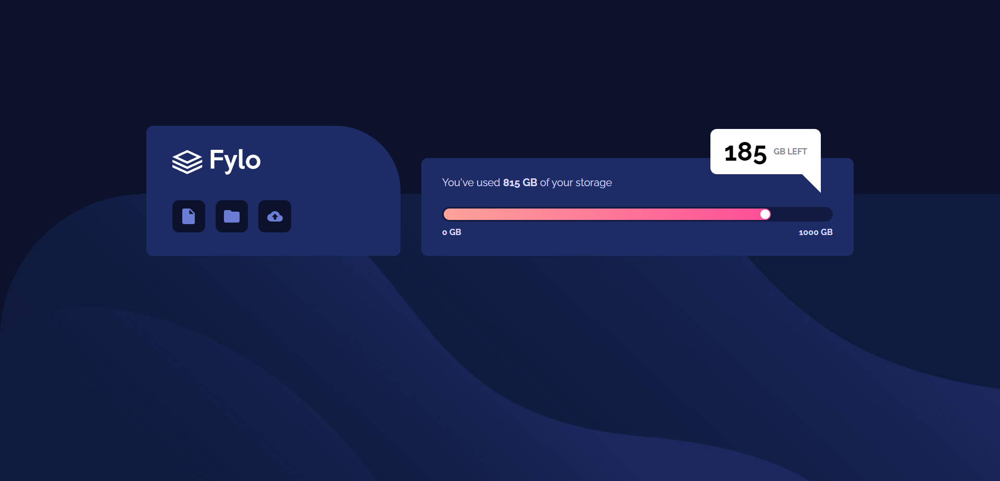

# Frontend Mentor - Fylo data storage component solution

This is a solution to the [Fylo data storage component challenge on Frontend Mentor](https://www.frontendmentor.io/challenges/fylo-data-storage-component-1dZPRbV5n). Frontend Mentor challenges help you improve your coding skills by building realistic projects. 

## Table of contents

- [Frontend Mentor - Fylo data storage component solution](#frontend-mentor---fylo-data-storage-component-solution)
  - [Table of contents](#table-of-contents)
  - [Overview](#overview)
    - [The challenge](#the-challenge)
    - [Screenshot](#screenshot)
    - [Links](#links)
  - [My process](#my-process)
    - [What I learned](#what-i-learned)
    - [Continued development](#continued-development)
    - [Useful resources](#useful-resources)
  - [Author](#author)

## Overview

### The challenge

Users should be able to:

- View the optimal layout for the site depending on their device's screen size

### Screenshot



### Links

- Solution URL: [Frontend Mentor](https://www.frontendmentor.io/challenges/fylo-data-storage-component-1dZPRbV5n/hub)
- Live Site URL: [Vercel](https://fylo-data-storage-component-ashy-eta.vercel.app)

## My process

### What I learned

I learned how to create a triangle for the `.storage-left` element. I also learned a bunch of `input[type="range"]` attributes and how to work with them.

1. This is how I used a `datalist` element to act as the label for my `input[type="range"]`.
```html
  <input type="range" id="storage-used" min="0" max="1000" list="values">

  <datalist id="values">
    <option value="0" label="0 GB"></option>
    <option value="1000" label="1000 GB"></option>
  </datalist>
```
```css
  datalist#values {
      display: flex;
      justify-content: space-between;
  }
  datalist#values > option {
      padding: 5px 0px 0px 0px;
      font-weight: 700;
      font-size: 13px;
  }
```
2. This is how I styled a right-angle triangle.

```html
    <div class="storage-left">
      <p>185 <span>GB Left</span></p>
      <div class="triangle"></div>
    </div>
```
```css
  .triangle {
      width: 50px;
      height: 50px;
      overflow: hidden;
      position: absolute;
      margin: 10px;
      bottom: -60px;
      right: -10px;
  }
  .triangle:after {
      content: '';
      background: white;
      width: 142%;
      height: 142%;
      position: absolute;
      transform: rotate(135deg) translate(-71%,0);
  }
```
### Continued development
The way I've coded it might work but I'm sure there are some improvements and inefficiencies in my code that I can improve upon. If you do find some, please let me know and I will get it fixed right away.

### Useful resources

- [MDN Input Range](https://developer.mozilla.org/en-US/docs/Web/HTML/Element/input/range) - This helped me understand some of the `input[type="range"]` attributes and how to work with them.
- [Create a Triangle using HTML & CSS](https://www.coding-dude.com/wp/css/create-a-triangle/#:~:text=How%20To%20Create%20a%20Triangle%20Using%20CSS%20transform%20and%20overflow,fall%20outside%20our%20div%20square) - Amazing article on how to create triangles in HTML & CSS.

## Author

- Website - [Justin Vera](https://www.justinvera.com)
- Frontend Mentor - [@justinnvera](https://www.frontendmentor.io/profile/justinnvera)
